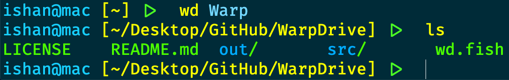

# WarpDrive - Warp across directories

WarpDrive is a replacement for `cd` (However it does use `cd` to work). It tracks your visited directories and uses a "frecency" algorithm (combining frequency and recency) to determine which directory to warp to. 



## Usage

You can use WarpDrive like this:
```sh
wd someDir
```
If you had visited `someDir` before (and thus `someDir` is in the datafile), it'll take you there. Otherwise, it'll just pass on the aguments to `cd` (which means that both relative and absolute paths work).

You could also do the same thing with just parts of the full path:
 ```sh
 wd s
 ```
 or 
 ```sh
 wd Dir
 ```
 ### Options
 Currently, WarpDrive has two options:
 
 **Option -a or --add**

This option adds paths. Paths are automatically added when you visit them.

```sh
wd -a /Users /usr/local/bin
```
**Option -l, --ls or --list**

Shows tracked directories and their points, sorted by most.
```sh
wd -l
```
Sample output:
```
Points Directory
150.0	/Users/ishan/Desktop/GitHub/WarpDrive
36.0	/Users/ishan/Desktop/tests/foo
6.0	/Users/ishan/.config/fish
5.0	/Users/ishan/.config
3.0	/Users/ishan/.config/fish/functions
1.0	/usr/libexec
1.0	/Library/Java/JavaVirtualMachines/openjdk-14.0.2.jdk/Contents/Home
1.0	/Library/Java/JavaVirtualMachines/openjdk-14.0.2.jdk/Contents/Home/bin
1.0	/
1.0	/Users/ishan/Downloads
1.0	/Users/ishan
1.0	/Users/ishan/.config/fish/conf.d
0.5	/Users/ishan/Desktop
0.5	/Users/ishan/Desktop/tests
```
 
 ### Different Arguments
 
 WarpDrive recognizes seperate arguments as matching different directories in a path. They do not need to be in order.
 
 Both
 ```sh
 wd grandParentDir parentDir childDir
 ```
 or 
 ```sh
 wd parent grand child
 ```
 will have the same result. 
 
 **Note! WarpDrive will *always* take you to a directory matching the last pattern. For more info on what this means, check the second Caveat.**
 
 ## Installing or Updating
 
 `fish` is currently supported.
 
 You need to have `java` installed for WarpDrive to work. Use `brew cask install java` if you have Homebrew installed
 
 ### Fish Install or Update
 
 WarpDrive can be **installed or updated** by
 
Having this:
 
 ```fish
 if test ! "$wd_last_added_dir"
    set -g wd_last_added_dir (pwd)
 end
 if test "$wd_last_added_dir" != (pwd) -a (pwd) != "$HOME"
    wd --add (pwd)
 end
 set -g wd_last_added_dir (pwd)
 ```
in your `fish_prompt` function and running this command in a `fish` shell:

```fish
curl https://raw.githubusercontent.com/quackduck/WarpDrive/master/install.fish | fish
```

## Compatibility

The datafile format is the same as rupa/z, jethrokuan/z, zsh-z and z.lua

## Known Issues

WarpDrive is a bit slow, compared to similar native shell scripts, taking ~160ms on average (This could be different for you. Do inform me about WarpDrive's performance)
This is because the JVM takes a lot of time to start up. The application itself takes 30ms.
 ## Caveats
 
  _WarpDrive stores data at_ `~/.WarpDriveData`.
 
 _WarpDrive will always take you to a directory that matches the last pattern given._ In other words, if the datafile contains two directories: `/foo/bar` and `/bar/foo` and you use the command `wd f` it will take you to `/bar/foo`.
 
 _WarpDrive is case sensitive. `wd Bar` is not the same as `wd bar`._

_Just `wd` takes you to the home directory._
 
 ### Suggestions are welcome, file those or issues [here](https://github.com/quackduck/WarpDrive/issues)
